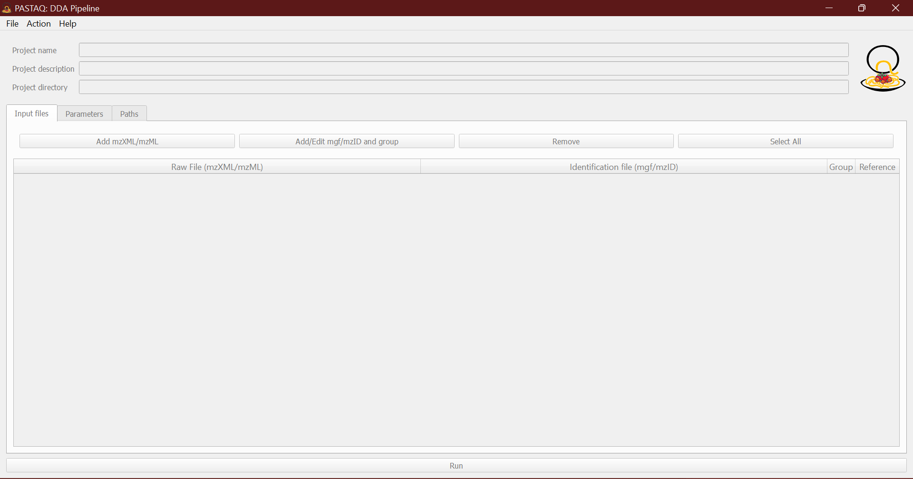
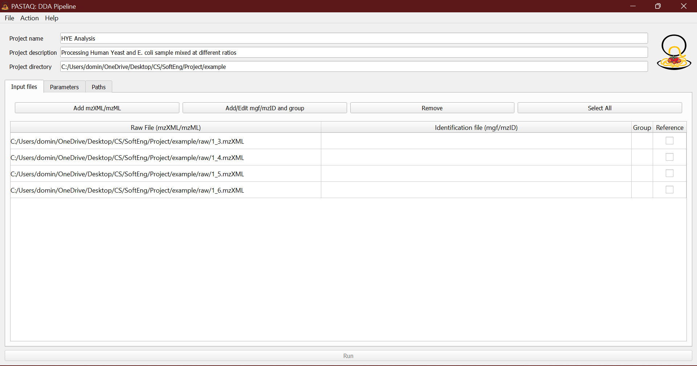
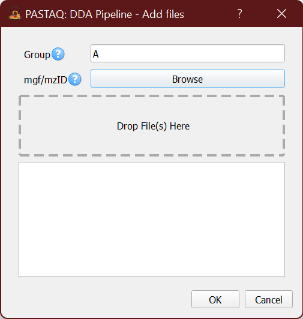
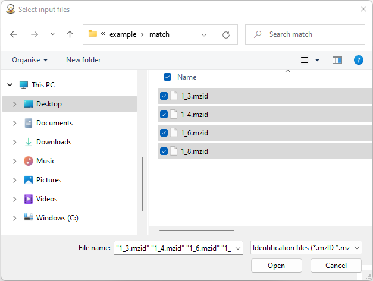
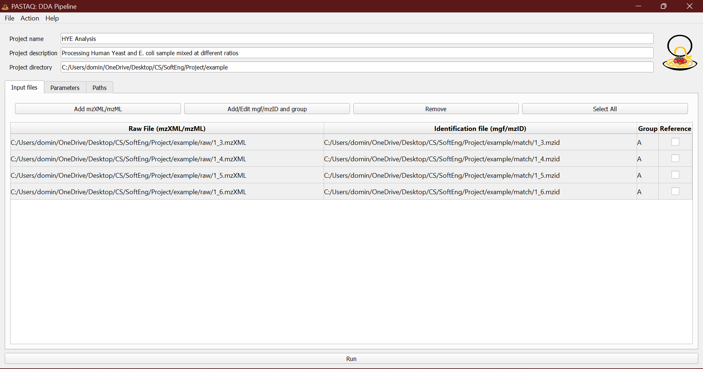
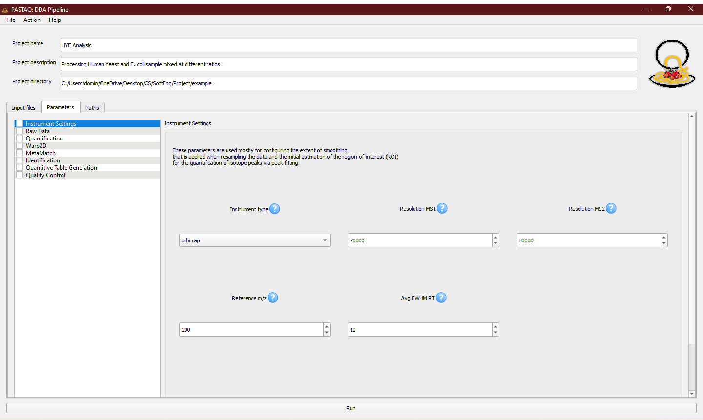

---

## PASTAQ-GUI Tutorial

---

PASTAQ-GUI can be used to setup the parameters of PASTAQ's DDA pipeline,
enabling the users to easily pre-process projects with an user friendly
interface. Note that this application is currently in beta and thus unexpected
errors can occur.

When starting PASTAQ-GUI you will be greeted with the following screen:

The `New project` button will initialize a project in the given directory,
creating a `parameters.json` file. This directory will also be used as the
output directory of the pipeline.

With the `Open project` button, a `parameters.json` file can be loaded. This
parameters file is the same that is generated in the output directory when the
DDA pipeline is run from the GUI or using the Python bindings. This enables
loading past projects even when the GUI was not used.

Once a project is active we can edit the project name and description and have
access to the rest of the parameters. Setting up the project name and
description is optional but recommended to have some context about the analysis
for the future.

The first step would be to add some samples in mzXML or mzML format using the
`Add` button in the `Input files` tab. Multiple files can be selected at once in
the file explorer.

Selecting multiple samples and pressing the `Edit` button allow us to change the
sample group and add identification files in mzIdentML format. For example, in
a control vs disease experiment, mark the samples from each group accordingly.

If multiple input files are selected when assigning the identification files,
they will be matched by the file name without the extension. For example
`1_1.mzXML` will be matched with `1_1.mzid`. This allows selecting all
identification files in a directory and letting the auto-match do the work
instead of manually assigning each identification file to the mzXML/mzML raw
data.

Repeat this for all sample groups as needed.

Next, switch over to the parameters tab to configure the pre-processing
settings. The default parameters should be a good starting point, but the user
must adjust the `Instrument settings` to match the type of mass spectrometer
used, the resolution at the given m/z and the expected average FWHM of retention
time peaks (in seconds).

With this in place, the project can be saved. If pressing the `Run` button at
the bottom of the screen the pipeline will be executed and the parameters will
be saved automatically. The progress can be seen in the progress dialog pop-up,
tracking each pre-processing. Note that while the pre-processing can be stopped
at any time with the `Cancel` button, doing so when writing intermediate files
to disk will result in corruption, and its not recommended. If this happens,
deleting the corrupted files will result in those files being processed again in
subsequent runs.

Once the pipeline has finished, the `Ok` button will appear, which is safe to
press to dismiss the progress dialog. Now you should be able to see the output
files in the project directory. We recommend looking at the `quality` folder to
explore the quality control plots generated by the pipeline. The different
quantitative tables can be found on the `quant` directory.

 

---
