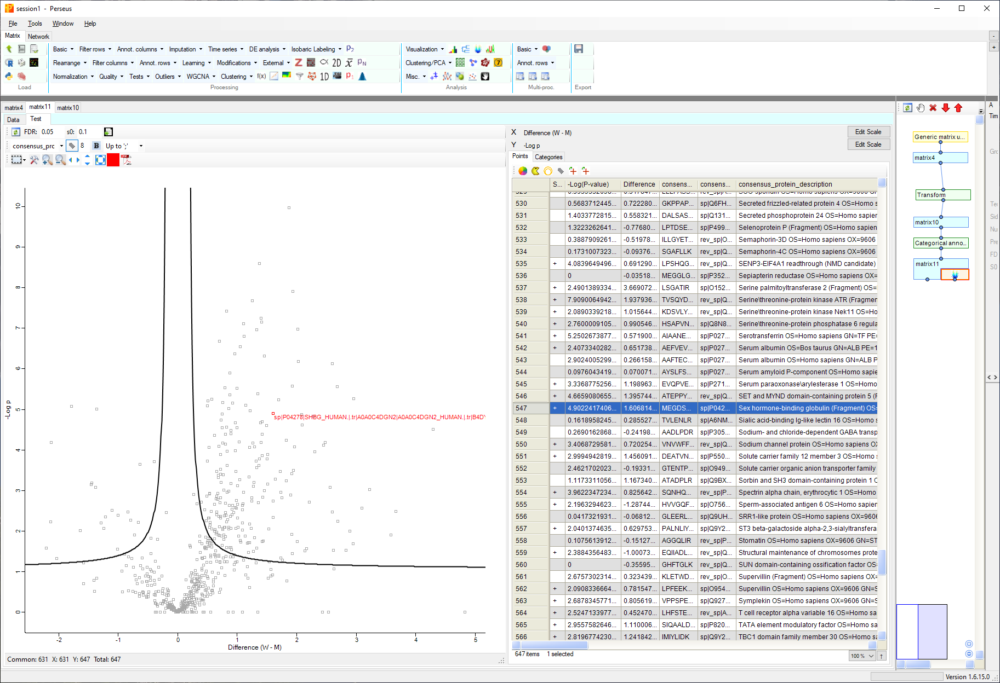

---

## Perseus analysis of PASTAQ quantitative tables

---

PASTAQ output csv text files, which can be easily imported in [Perseus][perseus]. Here is
an example of to process these quantitative tables with Perseus using
a male/female serum dataset. The protein group quantitative data can be found in
the `protein_groups.csv` table, and its corresponding metadata on the
`protein_groups_metadata.csv`. The two files are linked with unique integer key
located in the `protein_group_id` column.

[perseus]: https://maxquant.net/perseus/

### Steps for Perseus analysis

#### Import data able

Perseus requires both data and metadata to be within the same table. To merge
the quantitative and metadata tables from PASTAQ, we have a number of options
described below. Import `merged_protein_groups.csv` file in Perseus using the
“Generic matrix upload” command and include the quantitative columns as "main"
and the protein name/description annotations as "text".

##### Excel

Keys in the `protein_group_id` column are integer sorted in increasing value and
starting from 0. Open the two files separately and copy and paste the annotation
columns from `protein_groups_metadata.csv` in `protein_groups.csv`.  Comparing
the two columns with `protein_group_id` from both files can be used to check if
there is a mismatch between rows. Finally remove one of the `protein_group_id`
columns.

##### R script

```R
data <- read.csv("protein_groups.csv", header = TRUE)
metadata <- read.csv("protein_groups_metadata.csv", header = TRUE)
merged_table <- merge(metadata, data, by = "protein_group_id")
write.csv(merged_table, file = "merged_protein_groups.csv", row.names = FALSE)
```

##### Python script

```Python
import pandas as pd

data = pd.read_csv('protein_groups.csv')
metadata = pd.read_csv('protein_groups_metadata.csv')
merged_table = pd.merge(metadata, data, on = 'protein_group_id')
merged_table.to_csv('merged_protein_groups.csv')
```

#### Perform a T-Text and volcano plot

Perseus can be used to perform a T-test and visualize the results as follows:

- Perform log2 transformation of the quantitative values.
- Create the grouping categorical variable for man and woman using `“annotation
  rows” -> “Categorical annotation rows”`.
- Perform Volcano plot analysis with t-test and gender as categorical variable
  with man and woman categories.

The output screen of this workflow is shown below.

[](figures/perseus_example.png)

<br/>

---
